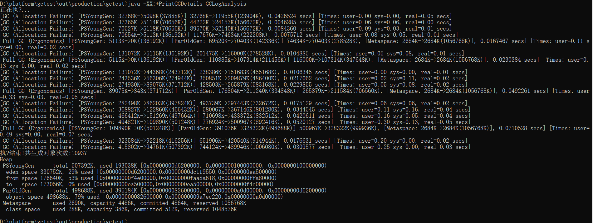
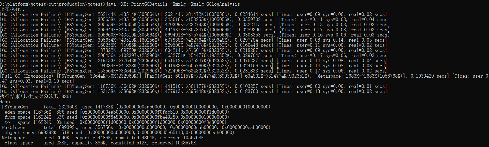
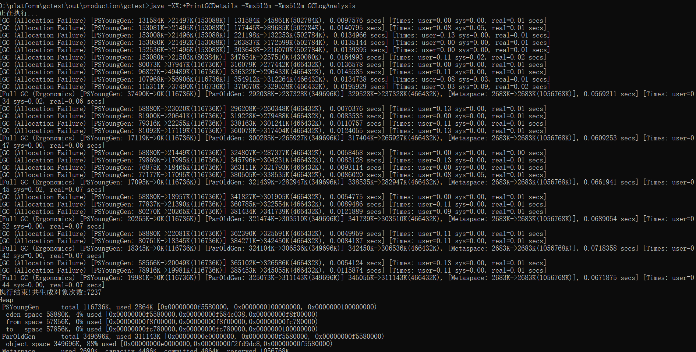
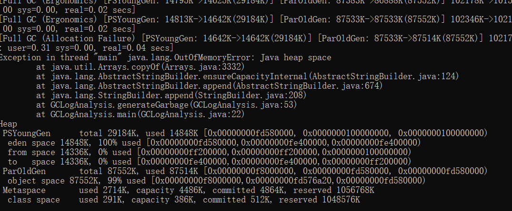
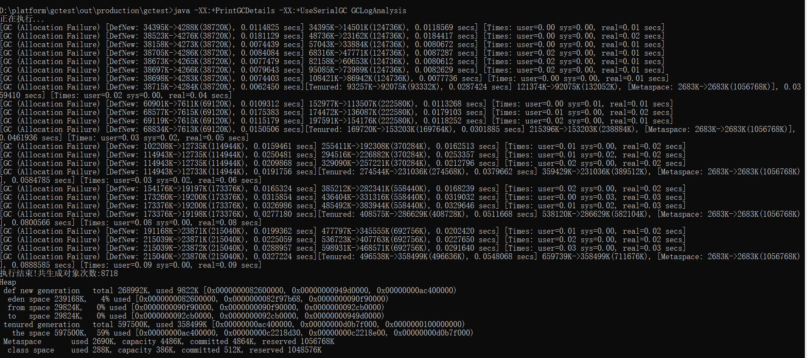
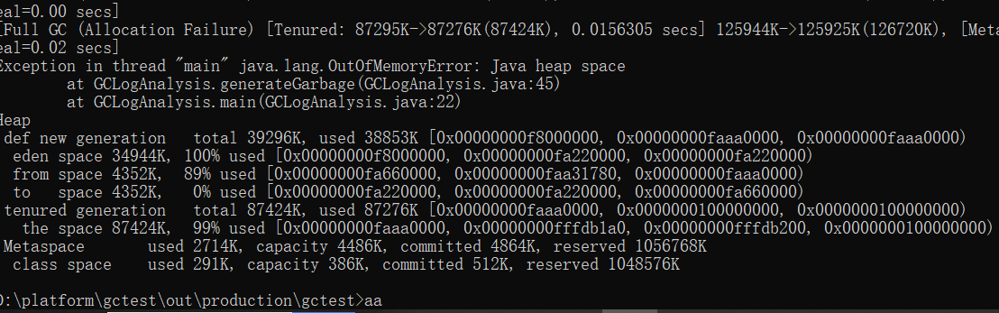
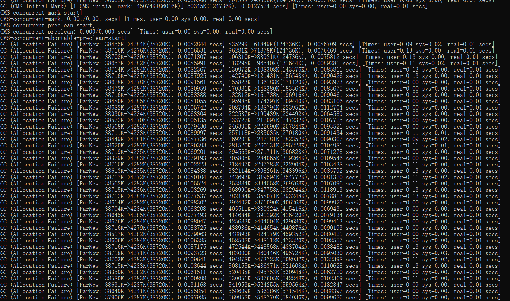
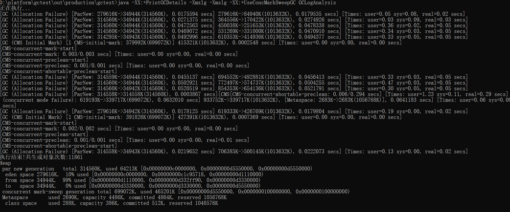
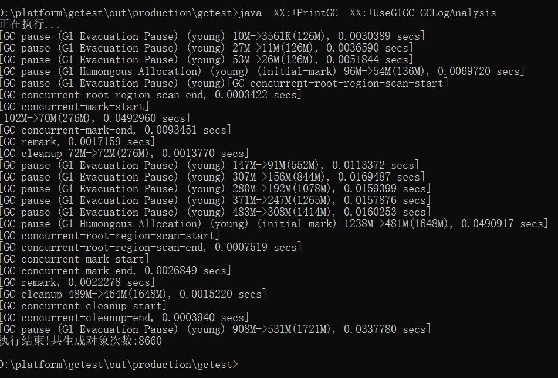

# 一、java8默认GC策略

1、java -XX:+PrintGCDetails GCLogAnalysis

JAVA8 使用默认GC：parallel

未配置最大堆内存和初始大小，堆内存的大小将随着full gc的次数增长而增长

2、java -XX:+PrintGCDetails -Xmx1g -Xms1g GCLogAnalysis

配置最大堆内存和初始大小为1g之后，明显地Full GC的次数少了

3、java -XX:+PrintGCDetails -Xmx512m -Xms1g512m GCLogAnalysis

反之，将堆内存设置为512m时，明显看出full gc的次数增加了

4、java -XX:+PrintGCDetails -Xmx128m -Xms128m GCLogAnalysis

当设置为128时，出现了OOM

# 二、使用串行化GC

1、java -XX:+PrintGCDetails -XX:+UseSerialGC GCLogAnalysis

与初次使用parallel输出类似

2、java -XX:+PrintGCDetails -Xmx128m -Xms128m -XX:+UseSerialGC GCLogAnalysis

同样地，128m时出现了OOM

# 三、使用CMS GC

1、java -XX:+PrintGCDetails -XX:+UseConcMarkSweepGC GCLogAnalysis

未指定最大堆内存和初始大小时，可以很明显地看到堆内存空间的增长

2、java -XX:+PrintGCDetails -Xmx1g -Xms1g -XX:+UseConcMarkSweepGC GCLogAnalysis

指定大小之后，可以通过gc日志看到CMS gc的几个阶段：Initial Mark（初始标记）、Concurrent Mark（并发标记）、Concurrent Preclean（并发预清理）、 Final Remark（最终标记）、 Concurrent Sweep（并发清除）、 Concurrent Reset（并发重置）

# 4、使用G1 GC

1、java -XX:+PrintGC -XX:+UseG1GC GCLogAnalysis

与CMS GC类似，G1 GC的几个步骤分别为：Initial Mark（初始标记）、Root Region Scan（Root区扫描）、Concurrent Mark（并发标记）、Remark（再次标记）、 Cleanup（清理）

